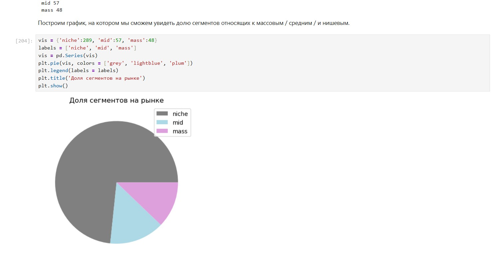

# Проект Анализ рынка инвестиций
## Бизнес-контекст
Финансовая компания, работающая с венчурными инвестициями, хочет понять закономерности финансирования стартапов и оценить перспективы выхода на рынок с покупкой и развитием компаний. Для этого необходимо провести исследование на исторических данных. Мы поработаем с информацией о компаниях, объёмах и типах привлечённых инвестиций, а также с дополнительной статистикой по возвратам средств.
## Цель проекта
Подготовить датасет к работе, исследовать динамику и структуру финансирования стартапов и ответить на вопросы, важные для оценки инвестиционных стратегий.
## Задачи:
1. Познакомиться с данными и предобработать их.
2. Сделать инжиниринг признаков.
3. Проанализировать выбросы.
4. Проанализировать динамику показателей.
5. Сделать итоговые выводы и рекоммендации.
   
Основной инструмент - `Python`.

